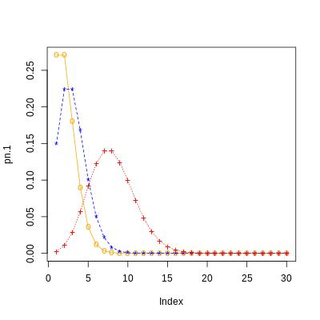

# Discussion Unit 5 MATH 1280

For this example, I will examine the number of applications someone hears back from within 30 days of sending them out. I will say that there are 3 different persons in this study, each with a corresponding value for $\lambda$. Since hearing back from a potential employer can be rare if you are not a star candidate, then this is indeed an occasion where the event in question occurring is rare.

1. $\lambda=3$ Red
2. $\lambda=8$ Blue
3. $\lambda=2$ Orange

Where $x={1, 2, 3,...,30}$.

With this information, we can now input it into R with our Poisson distribution function. As you might expect from the Poisson distribution, the data is skewed left more and more as the value for $\lambda$ grows smaller. This is due to a decrease in the probability of the event occurring, and as a result, the probability for a greater number of replies decreases further.A plot of three Poisson distributions

